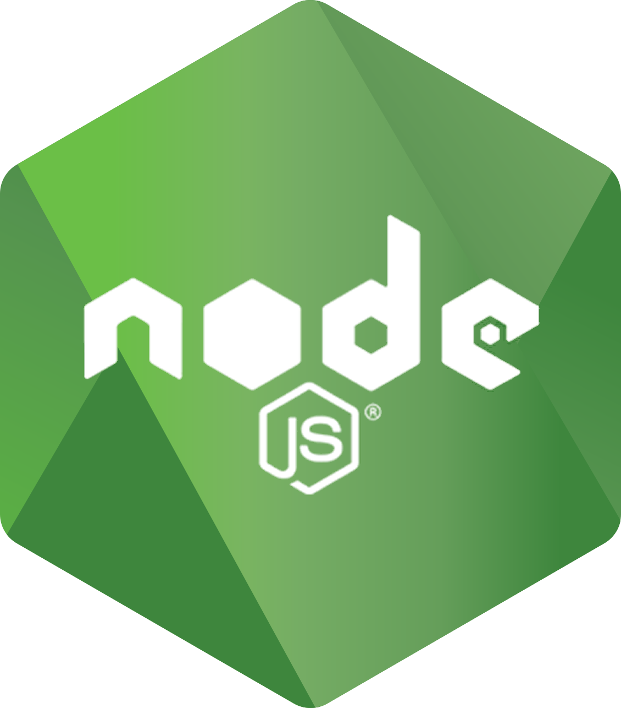
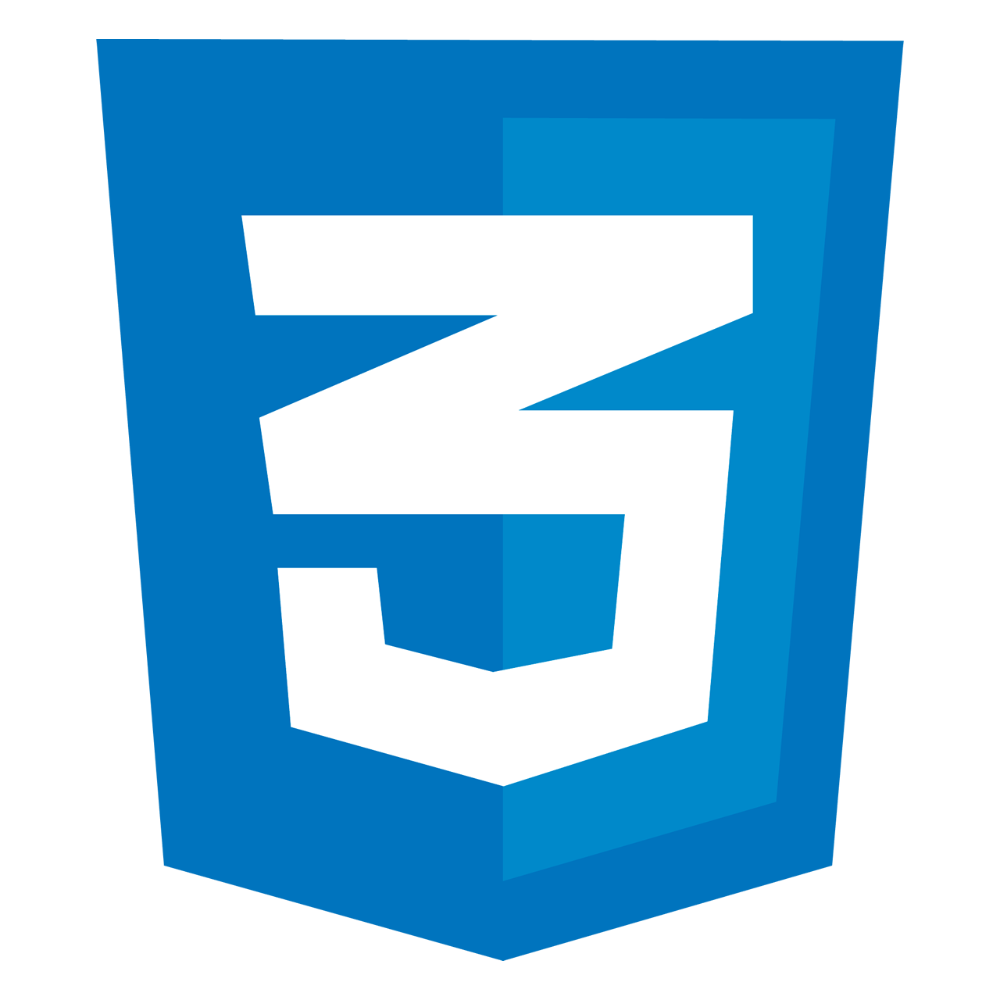
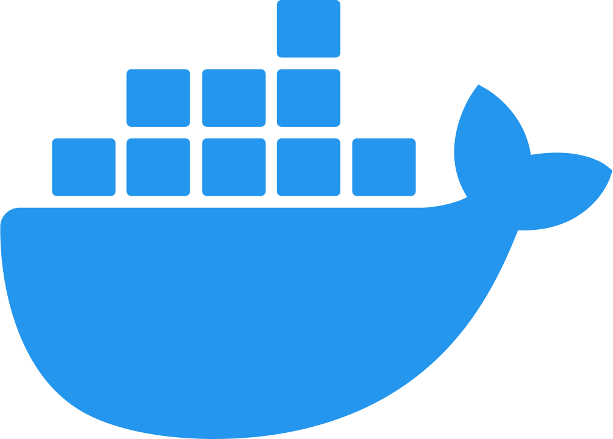
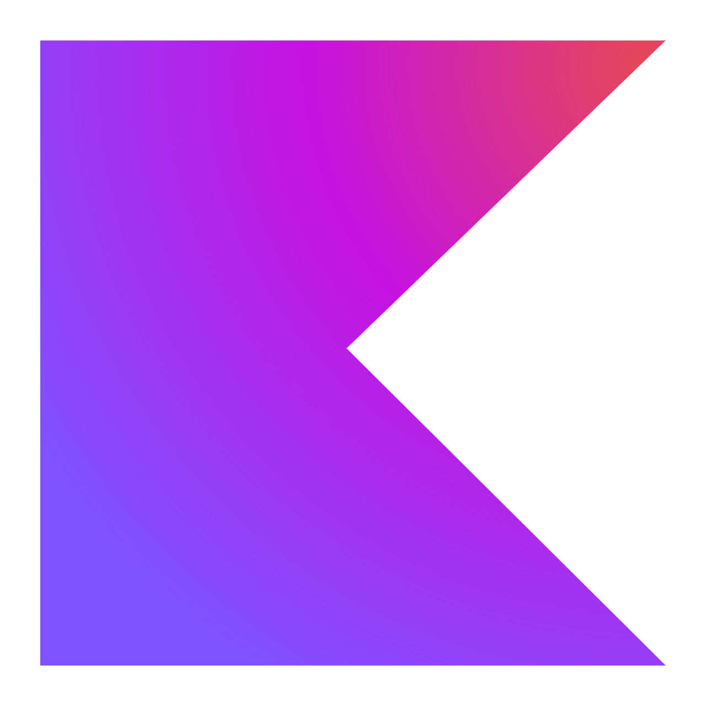

### Hi there 👋

+ I'm a Full-stack Software Develop currently working as a level II Frontend Developer at [Tinnova.](http://www.tinnova.com.br/)
+ I work daily with **JavaScript**, **Typescript**, **React**, **Next.js**, **Angular**, **Node.js**, **PostgreSQL**
+ I am very proficient at building frontend UIs using *Next.js/React.js/Angular* and *Typescript*.
+ Talk to me about new projects, creative ideas, startups and the opportunity to be part of your vision.

### 🚀 Languages and Tools:

 &nbsp;
 &nbsp;
 &nbsp;
 &nbsp;
 &nbsp;
 &nbsp;
</code> &nbsp;
</code> &nbsp;
</code> &nbsp;
</code> &nbsp;
</code> &nbsp;
</code> &nbsp;
</code> &nbsp;
 &nbsp;
 &nbsp;

### 🚀 I’m currently learning:

<!-- </code> -->
</code> &nbsp;
</code>

### Let's connect? 🤝

#

### ⚡ Github Stats</b>

[comment]: 

<!-- 
 -->

### ⚡ Technologies Stats</b>

 

<!--

+ I'm a Full-stack Software Engineer currently working as a level II Frontend Engineer at [Innovaccer, Inc.](https://innovaccer.com/)
+ I'm also a Top-rated Plus freelancer on [Upwork](https://upwork.com/) with 100% Job success.
+ I usually write articles on [my portfolio](https://awadieudonne.com/) and [medium](https://medium.com/@dieudonneawa7/)
+ I also create video contents and manage a [YouTube channel](https://www.youtube.com/channel/UC4Bh0roLmZn4RIYd4kcD7KQ) with over +70k views.
+ I work daily with **JavaScript**, **Typescript**, **React**, **Next.js**, **Node.js**, **MongoDB**, **GraphQL**
+ I am very proficient at building pixel-perfect frontend UIs using *Next.js/React.js* and *Typescript*.
+ Talk to me about new projects, creative ideas, startups and the opportunity to be part of your vision.

**manoelps/manoelps** is a ✨ _special_ ✨ repository because its `README.md` (this file) appears on your GitHub profile.

Here are some ideas to get you started:

- 🔭 I’m currently working on ...
- 🌱 I’m currently learning ...
- 👯 I’m looking to collaborate on ...
- 🤔 I’m looking for help with ...
- 💬 Ask me about ...
- 📫 How to reach me: ...
- 😄 Pronouns: ...
- ⚡ Fun fact: ...
-->
